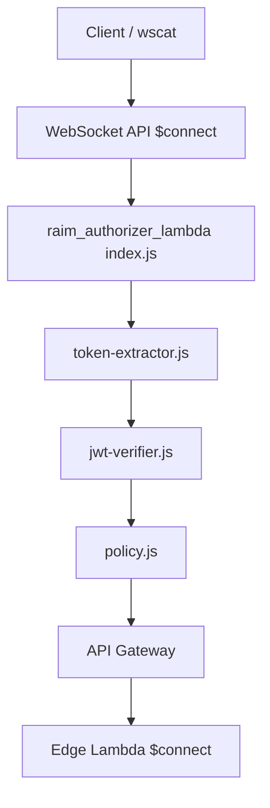

# RAiM Authorizer Lambda ファイル説明

このドキュメントは、`raim_authorizer_lambda` 配下の各ファイルが何を担当しているかを整理したものです。

Authorizer Lambdaは、WebSocket API Gatewayの `$connect` でCognito JWTを検証し、Edge LambdaへCognito `sub` を渡します。

## ファイル群の全体図

```text
raim_authorizer_lambda/
├── index.js                    ← Lambdaの入口。authorizer-serviceへ処理を渡す
├── package.json                ← 依存パッケージとnpm testコマンドの定義
├── package-lock.json           ← npm install後に作られる依存バージョン固定ファイル
├── DEPLOYMENT.md               ← 環境変数・API Gateway設定・wscat手順のメモ
├── FILES.md                    ← このファイル。Authorizer Lambda各ファイルの説明
├── lib/
│   ├── authorizer-service.js    ← Token抽出、JWT検証、Allow/Deny policy生成をまとめる
│   ├── config.js                ← Cognito User Pool/App Client設定を環境変数から読む
│   ├── jwt-verifier.js          ← aws-jwt-verifyでCognito JWTを検証する
│   ├── policy.js                ← API Gateway Lambda Authorizerのpolicy responseを作る
│   └── token-extractor.js       ← Authorization headerやqueryからJWTを取り出す
└── test/
    ├── authorizer-service.test.js ← 認証成功/失敗時のpolicy生成テスト
    ├── policy.test.js             ← Allow/Deny policy生成テスト
    └── token-extractor.test.js    ← Header/queryからのtoken抽出テスト
```

## 全体の処理フロー



## ルート直下のファイル

### `index.js`

Lambdaの入口です。

API Gatewayから渡されたAuthorizerイベントを `authorizer-service.js` に渡します。

### `package.json`

依存パッケージとテストコマンドを定義します。

主な依存:

- `aws-jwt-verify`
  - Cognito JWTの署名・期限・issuer・clientId・token_useを検証するために使用

### `DEPLOYMENT.md`

Authorizer LambdaをAWSへ設定するためのメモです。

主に次を記載しています。

- 必須環境変数
- WebSocket API GatewayのAuthorizer設定
- wscatでの接続例
- よくあるエラー

### `FILES.md`

このファイルです。

Authorizer Lambdaの各ファイルの役割を把握するための引き継ぎ資料です。

## `lib` 配下の実装ファイル

### `lib/authorizer-service.js`

Authorizer Lambdaの中心処理です。

主な役割:

- イベントからJWTを取り出す
- JWTをCognito User Pool設定で検証する
- `sub` が取れたらAllow policyを返す
- 検証失敗時はDeny policyを返す

### `lib/token-extractor.js`

API Gateway AuthorizerイベントからJWTを取り出します。

対応している入力:

- `Authorization: Bearer <JWT>`
- `Authorization: <JWT>`
- `?access_token=<JWT>`
- `?token=<JWT>`
- `identitySource` 配列

### `lib/jwt-verifier.js`

`aws-jwt-verify` を使ってCognito JWTを検証します。

検証する主な内容:

- JWT署名
- 有効期限
- issuer
- User Pool ID
- App Client ID
- token_use

### `lib/config.js`

Cognito検証に必要な環境変数を読み取ります。

必要な環境変数:

- `COGNITO_USER_POOL_ID`
- `COGNITO_CLIENT_ID`
- `COGNITO_TOKEN_USE`

### `lib/policy.js`

API Gateway Lambda Authorizerが期待するpolicy responseを作ります。

認証成功時は、`principalId` と `context.sub` の両方にCognito `sub` を入れます。

## `test` 配下のテストファイル

### `test/authorizer-service.test.js`

認証成功時にAllow、失敗時にDenyになることを確認します。

### `test/token-extractor.test.js`

Authorization headerやquery stringからJWTを取り出せることを確認します。

### `test/policy.test.js`

Allow/Deny policyがAPI Gateway向けの形で生成されることを確認します。
