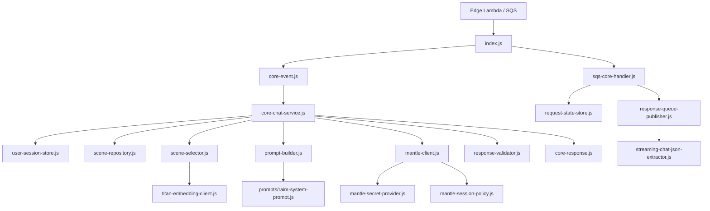

# RAiM Core Lambda ファイル説明

このドキュメントは、`raim_core_lambda` 配下の各ファイルが何を担当しているかを整理したものです。

Core Lambdaは、Edge Lambdaから渡されたユーザー入力を受け取り、DynamoDBの会話状態とFewShot Scene情報を参照しながら、Titan Text Embeddings V2でSceneを選択し、Bedrock Mantleへ会話生成を依頼します。SQS経由で呼ばれる場合は、生成中のテキストをResponse Queueへストリーミング通知します。

## ファイル群の全体図

```text
raim_core_lambda/
├── index.js                         ← Lambdaの入口。通常呼び出し/SQS呼び出しを振り分ける
├── package.json                     ← Node.js依存パッケージとnpm testコマンドの定義
├── package-lock.json                ← 依存パッケージのバージョン固定
├── DEPLOYMENT.md                    ← Lambda環境変数・IAM権限・アップロード手順のメモ
├── FILES.md                         ← このファイル。Core Lambda各ファイルの説明
├── lib/                             ← Core Lambdaの実装コード本体
│   ├── core-chat-service.js          ← 会話処理の中心。Session/Scene/Mantle/Titanをつなぐ
│   ├── core-event.js                 ← Edge Lambda/SQSから来た入力イベントを正規化する
│   ├── core-response.js              ← Edge Lambdaへ返す正常/エラーレスポンスを作る
│   ├── mantle-client.js              ← Bedrock Mantle Responses APIをストリーミング呼び出しする
│   ├── mantle-secret-provider.js     ← Mantle API KeyをSecrets Managerから取得する
│   ├── mantle-session-policy.js      ← previous_response_idを使えるか判定する
│   ├── prompt-builder.js             ← Mantleへ渡すsystem/user/few-shotメッセージを作る
│   ├── request-state-store.js        ← SQSリクエストの冪等性・処理状態をDynamoDBで管理する
│   ├── response-queue-publisher.js   ← 生成中/完了/エラーイベントをResponse Queueへ送る
│   ├── response-validator.js         ← MantleのJSON出力を検証し、emotion/intensityを補正する
│   ├── scene-repository.js           ← FewShotテーブルからScene定義を取得・正規化する
│   ├── scene-selector.js             ← ユーザー入力EmbeddingとtextCentroidを比較してSceneを選ぶ
│   ├── sqs-core-handler.js           ← SQS batch処理と部分失敗レスポンスを担当する
│   ├── streaming-chat-json-extractor.js ← Mantleのstreaming JSONからtext差分だけを抽出する
│   ├── titan-embedding-client.js     ← Titan Text Embeddings V2をBedrock Runtimeで呼び出す
│   ├── types.js                      ← chat/filler/proactiveなどの内部レスポンス型を作る
│   ├── user-session-store.js         ← UserSessionテーブルの読み書きを担当する
│   └── prompts/
│       └── raim-system-prompt.js     ← RAiMの人格・出力JSON形式・emotion方針を定義する
└── test/                             ← Node.js標準テストランナー用の単体テスト
    ├── core-chat-service.test.js     ← 会話処理全体に近い流れのテスト
    ├── core-event.test.js            ← 入力イベント正規化のテスト
    ├── core-response.test.js         ← レスポンス生成のテスト
    ├── index.test.js                 ← Lambda入口の振り分けテスト
    ├── mantle-client.test.js         ← Mantle API呼び出し・stream処理のテスト
    ├── mantle-secret-provider.test.js ← Secrets ManagerからAPI Keyを読む処理のテスト
    ├── prompt-builder.test.js        ← Scene/few-shotをMantle入力へ変換するテスト
    ├── request-state-store.test.js   ← SQS冪等性管理のテスト
    ├── response-queue-publisher.test.js ← Response Queue送信のテスト
    ├── scene-repository.test.js      ← FewShot Scene正規化のテスト
    ├── scene-selector.test.js        ← Titan Embedding後のScene選択ロジックのテスト
    ├── sqs-core-handler.test.js      ← SQS batch処理のテスト
    ├── streaming-chat-json-extractor.test.js ← streaming JSONからtextを抽出するテスト
    └── titan-embedding-client.test.js ← Titan Embedding呼び出しのテスト
```

まず全体を把握するなら、`index.js` → `lib/core-chat-service.js` → `lib/prompt-builder.js` / `lib/scene-selector.js` / `lib/mantle-client.js` の順に読むと流れを追いやすいです。

## 全体の処理フロー



## ルート直下のファイル

### `index.js`

Core Lambdaのエントリーポイントです。

主な役割:

- Lambdaに渡されたイベントが通常呼び出しかSQS呼び出しかを判定する
- SQSイベントの場合は `sqs-core-handler.js` に処理を委譲する
- 通常イベントの場合は `core-chat-service.js` を直接呼び出す
- 最終的にEdge Lambdaが扱いやすいレスポンス形式へ整える

このファイル自体には、MantleやTitanの細かい呼び出しロジックは置かず、ルーティング役に徹しています。

### `package.json`

Node.js Lambdaとして必要な依存パッケージとテストコマンドを定義しています。

主な依存:

- `@aws-sdk/client-bedrock-runtime`
  - Titan Text Embeddings V2のInvokeModelに使用
- `@aws-sdk/client-dynamodb`
  - DynamoDB低レベルクライアント
- `@aws-sdk/lib-dynamodb`
  - DynamoDB DocumentClient
- `@aws-sdk/client-sqs`
  - Response Queueへの送信に使用
- `@aws-sdk/client-secrets-manager`
  - Mantle API KeyをSecrets Managerから取得するために使用

テストは次で実行します。

```bash
npm test
```

### `package-lock.json`

依存パッケージのバージョン固定ファイルです。

`function.zip` を作成する前に `npm install` した状態を安定させるために使います。Lambdaへアップロードする場合は、`node_modules` も含めた状態で圧縮する必要があります。

### `DEPLOYMENT.md`

Core LambdaをAWS Lambdaへアップロードして動かすための設定メモです。

主に次を記載しています。

- 必須環境変数
- Secrets Manager方式でMantle API Keyを扱う方法
- DynamoDB / SQS / Bedrock / Secrets ManagerのIAM権限
- `function.zip` 作成時の注意点

CloudFormationを実デプロイに使わない場合でも、このファイルはLambda手動設定のチェックリストとして使えます。

### `FILES.md`

このファイルです。

Core Lambdaの各ファイルの役割を把握するための引き継ぎ資料です。

## `lib` 配下の実装ファイル

### `lib/core-event.js`

Core Lambdaに渡された入力イベントを、内部処理で扱いやすい形へ正規化します。

主な役割:

- Edge Lambdaから直接渡されたイベントを正規化する
- SQSメッセージ内のJSONを取り出して正規化する
- `sub`、`requestId`、`connectionId`、`userText`、`images` などを統一形式へ変換する
- 必須項目が不足している場合は入力エラーとして扱う

Core Lambdaの後続処理は、このファイルが整えた共通形式を前提に動きます。

### `lib/core-chat-service.js`

Core Lambdaの中心となる会話処理サービスです。

主な役割:

- ユーザーセッションをDynamoDBから取得する
- FewShot Scene一覧を取得する
- ユーザー入力をもとにSceneを選択する
- Mantleへ渡すプロンプト入力を作る
- Mantleを呼び出して応答を受け取る
- Mantleの応答JSONを検証する
- `lastResponseId` などの会話継続情報をUserSessionへ保存する
- SQS処理時はストリーミング中の差分をコールバックで外へ流す

Core Lambdaの実処理はほぼこのファイルに集約されています。各AWSサービスへの細かいアクセスは専用ファイルへ分離しています。

### `lib/core-response.js`

Core LambdaからEdge Lambdaへ返すレスポンス形式を作ります。

主な役割:

- 正常なチャットレスポンスを作る
- エラーレスポンスを作る
- 内部用フィールドをレスポンスから除外する
- `types.js` の型生成関数を通して、`text` / `emotion` / `intensity` の形式を安定させる

Edge Lambdaやクライアント側へ余計な内部情報を漏らさないための出口です。

### `lib/mantle-client.js`

Bedrock MantleのOpenAI互換Responses APIを呼び出すクライアントです。

主な役割:

- MantleエンドポイントURLを組み立てる
- Secrets Managerから取得したAPI KeyをAuthorizationヘッダーへ設定する
- `stream: true` でMantleへリクエストする
- Server-Sent Events形式のストリーミングレスポンスを解析する
- テキスト差分を `onTextDelta` コールバックへ流す
- 最終的な `response_id` と出力テキストを返す
- `previous_response_id` が期限切れ・無効だった場合の情報を上位へ伝える

MantleのHTTP通信の詳細はこのファイルに閉じ込めています。

### `lib/mantle-secret-provider.js`

Mantle API KeyをAWS Secrets Managerから取得します。

主な役割:

- `MANTLE_API_KEY_SECRET_ARN` で指定されたSecretを取得する
- `MANTLE_API_KEY_SECRET_JSON_KEY` で指定されたJSONキーからAPI Keyを取り出す
- `MANTLE_SECRET_REGION` のリージョンでSecrets Managerへアクセスする
- 取得済みのSecretをLambda実行環境内でキャッシュする
- Secret取得失敗時はリトライしやすいよう、失敗キャッシュを残さない

API KeyをLambda環境変数へ平文で置かないための重要なファイルです。

### `lib/mantle-session-policy.js`

Mantleの `previous_response_id` を使ってよいかを判定します。

主な役割:

- UserSessionに保存された `lastResponseId` が存在するか確認する
- `lastResponseExpiresAt` を見て期限切れかどうかを判断する
- 期限内なら継続会話として `previous_response_id` を使う
- 期限切れなら初回相当のプロンプトへ戻す

Mantle側の会話継続状態に依存しすぎないための安全弁です。

### `lib/prompt-builder.js`

Mantleへ渡す入力メッセージを組み立てます。

主な役割:

- RAiMの固定システムプロンプトを読み込む
- セッション要約をMantleへ渡す文脈に変換する
- 選択されたScene情報をMantleへ渡す文脈に変換する
- FewShot例をMantleのuser/assistantメッセージへ変換する
- ユーザー入力テキストと画像をMantle入力形式へ変換する
- 初回会話用と継続会話用で入力構成を切り替える

現在のFewShotテーブル形式では、次の属性を利用します。

- `embedding_text`
  - Scene選択用の代表テキスト
  - Mantleには「検索用テキスト」として補助的に渡す
- `default_emotions`
  - Sceneで出やすい感情傾向
  - Mantleのemotion選択の参考情報として渡す
- `few_shots[].emotions`
  - FewShot例に含まれる複数感情Map
  - Mantleの出力例では、最も強い感情を単一の `emotion` / `intensity` に変換する

### `lib/prompts/raim-system-prompt.js`

RAiMの固定システムプロンプトを定義します。

主な役割:

- RAiMの人格・話し方・応答方針を定義する
- Mantleに必ずJSON形式で返すよう指示する
- 出力形式を `text` / `emotion` / `intensity` に固定する
- 許可するemotion一覧を示す
- FewShotやScene情報の扱い方を指示する

Core Lambda全体の会話品質に強く影響するファイルです。

### `lib/scene-repository.js`

DynamoDBのFewShotテーブルからScene定義を取得します。

主な役割:

- `RAiM-FewShot-dev` からScene一覧をScanする
- `id` 指定で特定SceneをGetItemする
- fallback用のdefault Sceneを取得する
- DynamoDB ItemをCore Lambda内部で扱いやすい形へ正規化する

現在のFewShotテーブルでは、主に次を扱います。

- `id`
- `description`
- `embedding_text`
- `default_emotions`
- `few_shots`
- `textCentroid`

旧形式の `text_examples` / `examples` も互換用に保持していますが、現在のScene選択では `embedding_text` から作った `textCentroid` を使います。

### `lib/scene-selector.js`

ユーザー入力に最も近いSceneを選択します。

主な役割:

- ユーザー入力テキストをTitan Text Embeddings V2でEmbeddingする
- 各Sceneの `textCentroid` とコサイン類似度を計算する
- 最も類似度が高いSceneを選ぶ
- 類似度が閾値未満ならdefault Sceneへfallbackする
- テキストが空、centroid未整備、次元不一致などの場合もfallbackする

`textCentroid` は、FewShotテーブルの `embedding_text` を事前にEmbeddingした値です。ユーザー入力Embeddingと `textCentroid` は同じモデル・同じ次元数で生成されている必要があります。

### `lib/titan-embedding-client.js`

Amazon Bedrock Runtime経由でTitan Text Embeddings V2を呼び出します。

主な役割:

- Titan V2用のInvokeModelリクエストBodyを作る
- `inputText`、`dimensions`、`normalize`、`embeddingTypes` を設定する
- Bedrock Runtimeの標準リージョナルエンドポイントへアクセスする
- Titanのレスポンスからfloat embeddingを取り出す
- 次元数不一致や不正レスポンスを検出する

独自Titanエンドポイントは使用しません。`BEDROCK_REGION` または `AWS_REGION` に基づいてAWS SDKが標準エンドポイントを選びます。

### `lib/response-validator.js`

Mantleから返ってきたJSON応答を検証・補正します。

主な役割:

- Mantleの出力文字列をJSONとしてparseする
- `text` が空でないか確認する
- 未定義emotionを `neutral` に補正する
- `intensity` を0.0〜1.0の範囲へ丸める
- JSONでない応答や不完全な応答をCore Lambda用エラーに変換する

Mantleの出力が多少揺れても、クライアントへ返す形式を安定させるための防波堤です。

### `lib/streaming-chat-json-extractor.js`

Mantleのストリーミング出力から、`text` フィールド部分だけを差分抽出します。

主な役割:

- MantleがJSON文字列を少しずつ返す状況に対応する
- `{"text":"..."}` の `text` 値だけを途中経過として取り出す
- JSONエスケープやUnicodeエスケープが分割されても破綻しにくく処理する
- SQS Response Queueへ送る `stream.delta` の材料を作る

クライアントに「生成中の文章だけ」を見せるための補助です。

### `lib/response-queue-publisher.js`

Core LambdaからEdge Lambda側へ、SQS Response Queue経由でストリーミングイベントを送ります。

主な役割:

- `stream.start` を送る
- Mantle生成中のテキスト差分を `stream.delta` として送る
- 最終結果を `stream.completed` として送る
- エラーを `stream.error` として送る
- FIFO Queue向けにMessageGroupIdやDeduplicationIdを設定する
- 小さすぎるdeltaをまとめて送る

WebSocketへ直接返さず、SQSを介してEdge Lambdaへ戻す構成に対応するためのファイルです。

### `lib/request-state-store.js`

SQS経由で処理するリクエストの状態をDynamoDBへ保存します。

主な役割:

- 同じ `requestId` が重複処理されないようにする
- `PROCESSING` / `COMPLETED` / `FAILED` の状態を管理する
- Lambda再実行やSQS再配信時の二重応答を抑制する
- 処理中leaseとTTLを管理する

SQSは少なくとも1回配信のため、冪等性を保つために必要です。

### `lib/sqs-core-handler.js`

SQSイベントとしてCore Lambdaが呼ばれた場合の処理を担当します。

主な役割:

- SQS batchを1件ずつ処理する
- `request-state-store.js` で処理権を取得する
- `core-chat-service.js` を呼び出す
- `response-queue-publisher.js` でstreamイベントを送る
- 失敗したSQSレコードだけを `batchItemFailures` として返す

LambdaのSQS部分的バッチ失敗レスポンスに対応しています。

### `lib/user-session-store.js`

DynamoDBのUserSessionテーブルを読み書きします。

主な役割:

- ユーザーごとの現在セッション情報を取得する
- Mantleの `lastResponseId` を保存する
- `lastResponseExpiresAt` を保存する
- `sessionSummary` を保存・取得する
- 会話継続に必要な状態をCore Lambdaから分離する

Mantleの `previous_response_id` を使うための状態管理ファイルです。

### `lib/types.js`

Core Lambda内部で使うレスポンス型・イベント型の生成補助をまとめています。

主な役割:

- `chat` レスポンスを作る
- `filler` レスポンスを作る
- `proactive` レスポンスを作る
- emotion一覧を定義する
- intensityを0.0〜1.0へ丸める
- MantleのJSON出力をCore Lambda内部型へ変換する

クライアントへ返すデータ形式の基本定義に近いファイルです。

## `test` 配下のテストファイル

### `test/core-chat-service.test.js`

Core Lambdaの会話処理全体に近い単体テストです。

主な確認:

- 既存会話フローで正常応答できる
- 入力不正時に依存サービスを呼ばない
- Mantle応答検証エラーを正しく扱う
- `previous_response_id` 期限切れ時にリトライする
- Mantleストリーミング差分を順番に外へ流す

### `test/core-event.test.js`

入力イベント正規化のテストです。

主な確認:

- 直接呼び出しイベントを正規化できる
- SQSレコードを取り出せる
- 画像のみ入力を許可する
- `sub` など必須項目不足を検出する
- 複数SQSレコードを誤って1件扱いしない

### `test/core-response.test.js`

Core Lambdaのレスポンス生成テストです。

主な確認:

- Edge Lambda向けの正常レスポンスを作れる
- エラーレスポンスに `requestId` とエラー情報を含められる
- 内部用フィールドを外部レスポンスから除外できる
- エラー分類が想定どおり動く

### `test/index.test.js`

Lambdaエントリーポイントのルーティングテストです。

主な確認:

- SQSイベントが来た場合にSQS処理パスへ流れる
- 通常イベントとSQSイベントを区別できる

### `test/mantle-client.test.js`

Mantleクライアントのテストです。

主な確認:

- Mantleリクエストに `previous_response_id` を必要時だけ含める
- Bedrock Mantleのリージョナルエンドポイントを組み立てる
- OpenAI互換Responses APIのストリーミング形式を扱える
- Mantle応答から `response_id` や出力テキストを取り出せる

### `test/mantle-secret-provider.test.js`

Secrets ManagerからMantle API Keyを取得する処理のテストです。

主な確認:

- 指定したJSONキーからAPI Keyを取得できる
- 取得結果をキャッシュできる
- 失敗時は次回リトライできる
- 必須環境変数不足を検出する
- SecretBinaryも扱える

### `test/prompt-builder.test.js`

Mantleへ渡すプロンプト生成のテストです。

主な確認:

- Scene文脈に `embedding_text` と `default_emotions` が含まれる
- `few_shots[].emotions` Mapを単一 `emotion` / `intensity` の応答例へ変換できる
- 継続会話時のSceneヒントがsystem messageとして入る

### `test/request-state-store.test.js`

SQSリクエスト状態管理のテストです。

主な確認:

- 処理中leaseを作れる
- 完了済みリクエストの重複を検出できる
- 完了時にleaseを解放できる

### `test/response-queue-publisher.test.js`

Response Queueへ送るストリーミングイベントのテストです。

主な確認:

- FIFO SQSへ順序付きイベントを送れる
- 小さなdeltaをバッファリングできる
- completedイベントに最終結果を含められる

### `test/scene-repository.test.js`

FewShotテーブルのScene正規化テストです。

主な確認:

- 新形式の `embedding_text` を保持できる
- `default_emotions` を保持できる
- `few_shots[].emotions` を保持できる
- `hasEmbeddingText` のデバッグサマリを作れる

### `test/scene-selector.test.js`

Scene選択ロジックのテストです。

主な確認:

- コサイン類似度で最も近いSceneを選べる
- Titan Embedding結果を使ってScene選択できる
- `textCentroid` が未整備の場合にdefaultへfallbackできる

### `test/sqs-core-handler.test.js`

SQS経由のCore処理テストです。

主な確認:

- ストリーミング抽出結果をResponse Queueへ流せる
- 成功・失敗したSQSレコードを正しく扱える
- `batchItemFailures` を必要な分だけ返せる

### `test/streaming-chat-json-extractor.test.js`

MantleのストリーミングJSONから `text` を抽出するテストです。

主な確認:

- JSON文字列が分割されても `text` の中身だけを取り出せる
- Unicodeエスケープが途中で分割されても処理できる

### `test/titan-embedding-client.test.js`

Titan Embeddingクライアントのテストです。

主な確認:

- Titan V2用のリクエストBodyを作れる
- Bedrock Runtime InvokeModelを呼び出せる
- 返ってきたEmbeddingの次元数を検証できる
- 独自TitanエンドポイントではなくAWS SDK標準エンドポイントを使う

## 関連するワークスペース直下の補助スクリプト

以下は `raim_core_lambda` 配下ではありませんが、Core LambdaのScene選択準備・検証に使う補助スクリプトです。

### `generate_scene_centroids.js`

FewShotテーブルの `embedding_text` をTitan Text Embeddings V2でEmbeddingし、同じDynamoDBアイテムの `textCentroid` に保存します。

Core LambdaのScene選択を実AWSで動かす前に、まずこのスクリプトで `textCentroid` を作成します。

### `test_scene_selection.js`

ユーザー入力をTitanでEmbeddingし、FewShotテーブルの `textCentroid` と比較して、どのSceneが選ばれるかをCloudShell上で確認するスクリプトです。

Mantleは呼ばないため、Scene選択だけを切り分けてテストできます。

## Lambdaへアップロードするときの注意

`function.zip` としてアップロードする対象は、基本的に `raim_core_lambda` の中身です。

必要なもの:

- `index.js`
- `lib/**`
- `package.json`
- `package-lock.json`
- `node_modules/**`

不要なもの:

- `test/**`
- `DEPLOYMENT.md`
- `FILES.md`

ただし、ファイルサイズに余裕があり、検証目的で含めたい場合は `test/**` やMarkdownを含めてもLambda実行自体には通常影響しません。
