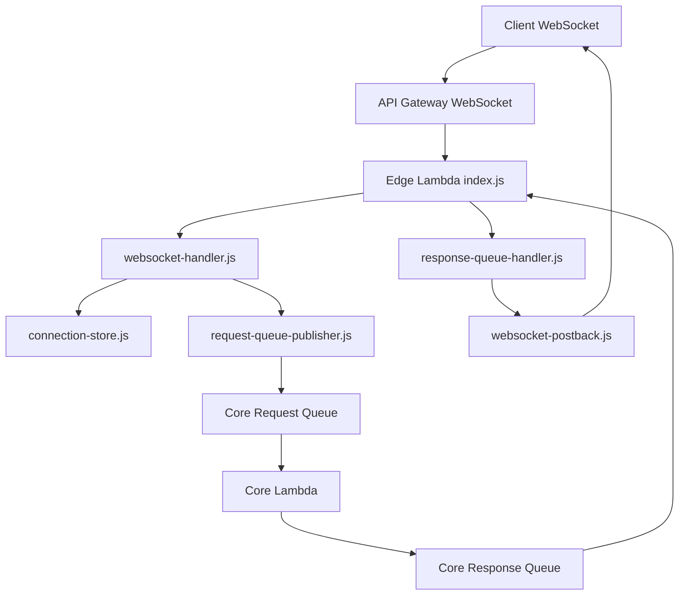

# RAiM Edge Lambda ファイル説明

このドキュメントは、`raim_edge_lambda` 配下の各ファイルが何を担当しているかを整理したものです。

Edge Lambdaは、クライアントのWebSocket接続を受け付け、ユーザー入力をCore Lambda用Request Queueへ送り、Core Lambdaから戻ってきたResponse QueueイベントをWebSocketへ返す役割を持ちます。

Response Queueは環境変数ではなく、Edge LambdaのSQSイベントソースマッピングとして紐づけます。

## ファイル群の全体図

```text
raim_edge_lambda/
├── index.js                         ← Lambdaの入口。WebSocketイベント/SQSイベントを振り分ける
├── package.json                     ← Node.js依存パッケージとnpm testコマンドの定義
├── package-lock.json                ← npm install後に作られる依存バージョン固定ファイル
├── DEPLOYMENT.md                    ← 環境変数・IAM権限・アップロード手順のメモ
├── FILES.md                         ← このファイル。Edge Lambda各ファイルの説明
├── lib/                             ← Edge Lambdaの実装コード本体
│   ├── client-message.js             ← Coreのstreamイベントをクライアント向けJSONへ変換する
│   ├── config.js                     ← 必須環境変数を読み取り、設定ミスを早めに検出する
│   ├── connection-store.js           ← WebSocket connectionIdをDynamoDBへ保存/取得/削除する
│   ├── request-queue-publisher.js    ← ユーザー入力をCore Lambda用Request Queueへ送る
│   ├── response-queue-handler.js     ← Core Response QueueイベントをWebSocketへ中継する
│   ├── websocket-event.js            ← API Gateway WebSocketイベントを正規化する
│   ├── websocket-handler.js          ← $connect/$disconnect/$default routeを処理する
│   ├── websocket-postback.js         ← ApiGatewayManagementApiでconnectionIdへpostする
│   └── websocket-response.js         ← API Gatewayへ返すHTTP形式レスポンスを作る
└── test/                             ← Node.js標準テストランナー用の単体テスト
    ├── client-message.test.js        ← streamイベント変換のテスト
    ├── index.test.js                 ← WebSocket/SQSイベント判定のテスト
    ├── response-queue-handler.test.js ← Response QueueからWebSocket返信までのテスト
    ├── websocket-event.test.js       ← WebSocketイベント正規化のテスト
    └── websocket-handler.test.js     ← $connect/$disconnect/$default処理のテスト
```

まず全体を把握するなら、`index.js` → `lib/websocket-handler.js` → `lib/request-queue-publisher.js` → `lib/response-queue-handler.js` の順に読むと流れを追いやすいです。

## 全体の処理フロー



## ルート直下のファイル

### `index.js`

Edge Lambdaのエントリーポイントです。

主な役割:

- API Gateway WebSocketイベントかSQSイベントかを判定する
- WebSocketイベントなら `websocket-handler.js` へ渡す
- SQSイベントなら `response-queue-handler.js` へ渡す
- 想定外イベントの場合は400レスポンスを返す

### `package.json`

Edge Lambdaで使うAWS SDKとテストコマンドを定義します。

主な依存:

- `@aws-sdk/client-apigatewaymanagementapi`
  - WebSocket connectionIdへpostするために使用
- `@aws-sdk/client-dynamodb`
  - DynamoDB低レベルクライアント
- `@aws-sdk/lib-dynamodb`
  - DynamoDB DocumentClient
- `@aws-sdk/client-sqs`
  - Core Request Queueへメッセージを送るために使用

### `DEPLOYMENT.md`

Lambda環境変数、IAM権限、必要なAWSリソース、`function.zip` に含めるものをまとめたメモです。

### `FILES.md`

このファイルです。

Edge Lambdaの各ファイルの役割を把握するための引き継ぎ資料です。

## `lib` 配下の実装ファイル

### `lib/config.js`

環境変数を読み取り、必須値が無い場合は明確なエラーにします。

扱う主な環境変数:

- `REQUEST_QUEUE_URL`
- `CONNECTION_TABLE_NAME`
- `WEBSOCKET_API_ENDPOINT`
- `CONNECTION_TTL_SECONDS`

### `lib/websocket-event.js`

API Gateway WebSocketイベントをEdge Lambda内部形式へ正規化します。

主な役割:

- `routeKey` を取り出す
- `connectionId` を取り出す
- Cognito Authorizerから `sub` を取り出す
- JSON bodyをparseする
- `text` / `images` / `requestId` を正規化する
- 入力不正を `WebSocketEventError` として返す

### `lib/websocket-handler.js`

WebSocket routeごとの処理を担当します。

主な処理:

- `$connect`
  - `connection-store.js` で接続情報を保存する
- `$disconnect`
  - `connection-store.js` で接続情報を削除する
- `$default`
  - ユーザー入力を `request-queue-publisher.js` でCore Request Queueへ送る

### `lib/connection-store.js`

DynamoDBのWebSocket接続管理テーブルを操作します。

保存する主な情報:

- `connectionId`
- `sub`
- `domainName`
- `stage`
- `connectedAt`
- `updatedAt`
- `expiresAt`

`expiresAt` はTTL用です。切断イベントが取りこぼされた場合でも、古い接続情報を自動削除できるようにします。

`$default` イベントにCognito `sub` が含まれない場合は、このテーブルからconnectionIdに紐づく `sub` を取得してCore Lambdaへ渡します。

### `lib/request-queue-publisher.js`

ユーザー入力をCore Lambda用Request Queueへ送信します。

送信する主な情報:

- `requestId`
- `connectionId`
- `sub`
- `source: "websocket"`
- `text`
- `images`

FIFO Queueを想定し、`MessageGroupId` にはconnectionIdを使います。同じ接続から送られたメッセージを順番にCore Lambdaへ渡すためです。

### `lib/response-queue-handler.js`

Core LambdaがResponse Queueへ送ったstreamイベントを処理します。

主な役割:

- SQSレコードのbodyをJSON parseする
- Coreのstreamイベントをクライアント向けメッセージへ変換する
- `websocket-postback.js` でWebSocketへ送信する
- `GoneException` の場合はDynamoDBの接続情報を削除し、SQS再試行はしない
- 一時的な失敗だけ `batchItemFailures` に入れて再試行対象にする

### `lib/websocket-postback.js`

API Gateway Management APIを使って、指定connectionIdへJSONを送ります。

Response Queue経由のLambdaイベントにはAPI Gatewayのdomain/stageが無いため、`WEBSOCKET_API_ENDPOINT` 環境変数が必要です。

### `lib/client-message.js`

Core Lambda内部のstreamイベントを、クライアントへ送りやすいJSONへ変換します。

対応イベント:

- `stream.start`
- `stream.delta`
- `stream.completed`
- `stream.error`

`RAiM-CoreResponse-dev.fifo` は、LambdaのSQSトリガーとしてEdge Lambdaへ紐づけます。
Edge Lambdaの環境変数にResponse Queue URLを設定する必要はありません。

### `lib/websocket-response.js`

API Gateway WebSocket route呼び出しに返すHTTP形式レスポンスを作ります。

主に `$connect` / `$disconnect` / `$default` の受付結果を返すために使います。

## `test` 配下のテストファイル

### `test/websocket-event.test.js`

WebSocketイベントの正規化を確認します。

### `test/websocket-handler.test.js`

`$connect` / `$disconnect` / `$default` の処理を確認します。

### `test/response-queue-handler.test.js`

Core Response QueueからWebSocket postまでの処理を確認します。

### `test/client-message.test.js`

Coreのstreamイベントをクライアント向けJSONへ変換できることを確認します。

## Core Lambdaとの接続点

Edge LambdaがCore Lambdaへ渡すRequest Queueメッセージは、Core Lambdaの `core-event.js` が受け取れる形式です。

```json
{
  "schemaVersion": 1,
  "type": "chat.request",
  "requestId": "req-001",
  "connectionId": "connection-id",
  "sub": "cognito-user-sub",
  "source": "websocket",
  "text": "こんにちは",
  "images": [],
  "createdAt": "2026-06-25T00:00:00.000Z"
}
```

Core LambdaからEdge Lambdaへ戻るResponse Queueメッセージは、`stream.*` イベントとして処理されます。
